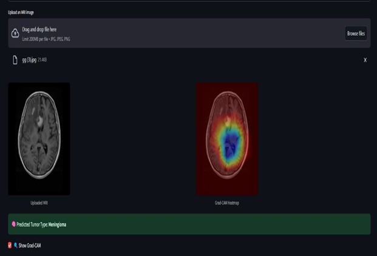
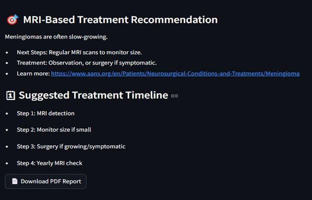
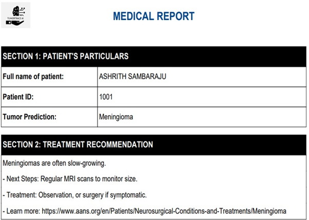
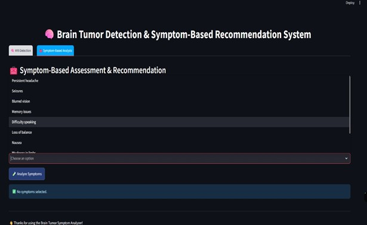
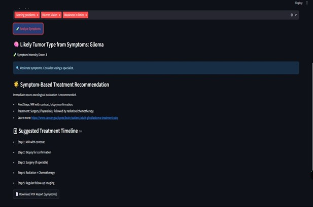
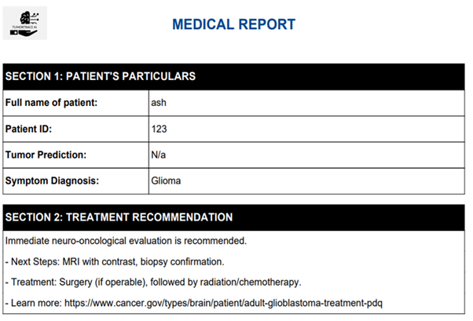
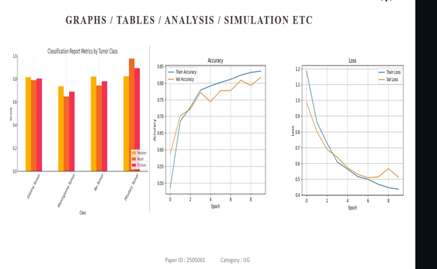

# Brain Tumor Detection & Symptom-Based Recommendation System

## Overview  
This is a deep learning-based web application for early detection and classification of brain tumors using contrast-enhanced MRI scans, with an integrated symptom-based analysis module for initial screening. The system combines a hybrid CNN architecture (VGG16 + ResNet-50), EfficientNetB2, and Grad-CAM for accurate, explainable predictions. The Streamlit interface provides easy upload, real-time classification, and downloadable PDF medical reports.

---

## Key Features  

- **Hybrid CNN Model**: VGG16 and ResNet-50 combined for enhanced feature extraction and tumor classification.  
- **EfficientNetB2 Support**: Lightweight high-performance model integration.  
- **Explainable AI**: Grad-CAM visualizations show the exact tumor region influencing the decision.  
- **Symptom-Based Risk Screening**: Analyzes user-reported symptoms to offer possible tumor types and recommendations.  
- **Automated Medical Reports**: Personalized, downloadable PDF reports including predictions, Grad-CAM maps, and treatment suggestions.  
- **Interactive UI**: Built with Streamlit for seamless user experience.

---

## Technology Stack  

- **Deep Learning Models**: VGG16, ResNet-50, EfficientNetB2  
- **Explainability**: Grad-CAM (Class Activation Mapping)  
- **Frontend**: Streamlit  
- **Backend**: Python, TensorFlow/Keras, OpenCV  
- **PDF Generation**: ReportLab / FPDF / PyMuPDF  

---

## Output Screenshots

### MRI-Based Classification

**Filling Patient Details**  


**MRI-Based Classification Output**  


**MRI-Based Treatment Recommendation**  


**MRI-Based Medical Report**  


---

### Symptom-Based Classification

**Symptom-Based Classification Interface**  


**Symptom-Based Treatment Recommendation**  


**Symptom-Based Medical Report**  


---

### Evaluation Results

**Model Accuracy, Loss, and Classification Report**  


---

## How to Run the Project

### 1. Clone the Repository and Set Up the Environment

```bash
git clone https://github.com/ASHRITH-SAMBARAJU/BRAIN-TUMOR-DETECTION.git
cd BRAIN-TUMOR-DETECTION

# (Optional) Create and activate a virtual environment
python -m venv venv
venv\Scripts\activate   # For Windows

# Install required dependencies
pip install -r requirements.txt

# Run the Streamlit app
streamlit run main.py


